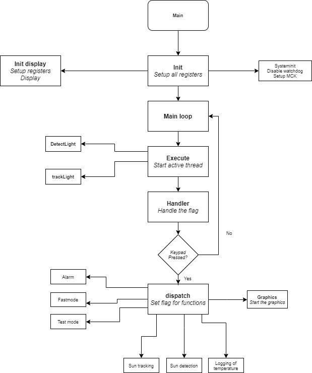

# DST1
Development of Computer System Engineering,winter 2018. The Modules named below is the ones that should be implemented to function and present information as following: Temperature reading, Present data with graphs, Find the position of the sun, Follow the position of the sun, Alarm for the temperature, Fixed mode and Extended test mode. 

Hardware:
* Arduino Due, atmel sam3X8E
* Display (port I/O)
* Switch (HW-int)

Modules:
* Temperature Sensor
* Photoresistor
* LCD display
* Keypad
* RC servo motor

## Implemented features
### Temperature reading
With the help of a flag, you can decide whether the sensor should perform a reset, wait for the reset and start the measurement, wait for a response from the measurement or end the measurement. Resets the flag and stores the data provided by the sensor. For each change of the flag, its previous task will be terminated.
### Present data with graphs
By activating the graphical interface, it is possible to print coordinated graphs and an informative zone in order to present the data that has been stored. Connected from the keypad, you can choose which day you want to study. Depending on the data stored for maximum, minimum and average values during the specific day, the graph will be scaled back to be able to handle an extremely accurate precision if only small decimal numbers are changed.
### Position of the sun
When the function that handles the detection of the sun is called, the servo is reset to a "zero position" where it can then start searching for the strongest light source (lower value results in a stronger light source). At a slow speed, the servo approaches a position 180 degrees from the "zero position" and compares the value stored to the current brightness. Should a new value occur that is smaller than the current one, the new value will overwrite the previous value and store the angle of the servo. The data stored will contain the angle of the servo written on the display and updated ten times per second.
### Follow position of the sun
The function is based on incrementing the angle with the photo resistors input and the Angle acceleration as negative feedback. The input consists of the differences between the two photo resistors. The angular acceleration is approximated from the derivative of the velocity (input).
### Temperature alarm
When selecting start values, the maximum and minimum values ​​that the temperature sensor tolerates are used.
The possibility for the user to change the boundaries themselves is done via the menu, which includes both positive and negative numbers. If the limits are reached for the alarm, a flag will be set and notify the user that the temperature limits have been reached. To reset the flag, you must enter the alarm menu. When choosing your own boundaries, three values ​​must be specified: character value, integer and decimal number. This should be repeated for both the minimum and maximum limits.
## Fast Fashion
When activated, the definition is reduced from one minute to one second. Only the functions due to one minute are affected, the rest of the system continues normally.
## Extended test mode
Upon activation, a function is called which stores a fine (its) function which in turn is printed on the graph as the user enters the graphical interface.

## Unit test
For testing the hardware on each module. Checks so all hardware responds and records values ​​that may be appropriate to receive in response.

## Flowchart

